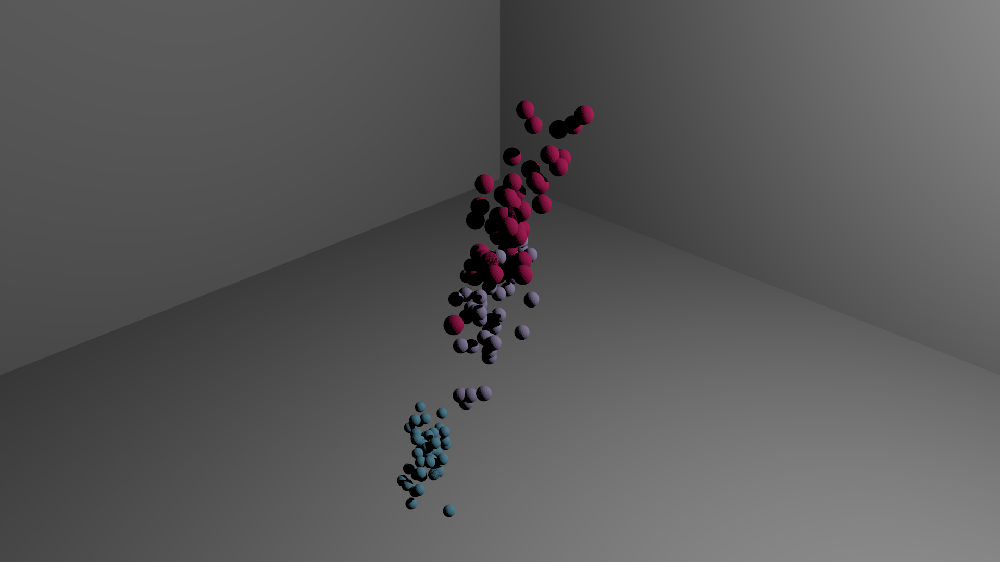

Blender Data Visualizaton (Yet Another?)
===

Provide matplotlib-like function to plot, envoke Blender to run generated python script to render the result.

A initial committed scatter plot for Iris dataset:
